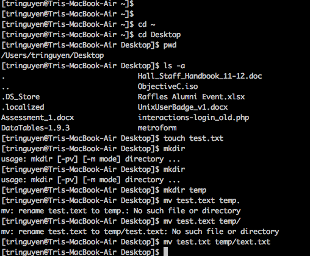
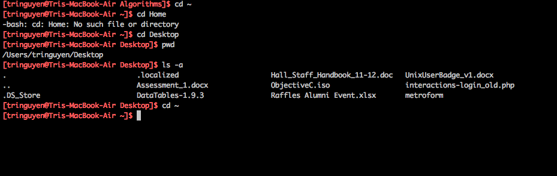

a.k.a. first blog post on this site.

## Foreword (you have been warned!):

I have decided to keep the design of this site simple and use the blog to keep track of my learning and exploration on the computer world.

I will try my best to categorize and organize the post into some sort of order, but it's hard to do that starting out without an overkill of empty categories and tags. This space is mostly going to be for myself to look back and document what I have learned though, so I think a certain degree of flexibility is allowed.

Anyway, let's get started.

My first post is dedicated to how to change the color of your Command Line Prompt. In this case, I am using both Terminal.app and [iTerm2.app](http://www.iterm2.com/ "iTerm2") on Mac OSX Mountain Lion.

My terminal, for the longest time, looks like this:



I was getting tired of it, because, as a visual person, I find myself spending a lot of time trying to figure out which line was my prompt and which was the code. So I went on a Google search hunt to figure out the solution to change the color of my prompt.

After poking at a few places, I came across this StackExchange question ["In bash how can I change the color of my command prompt?"](http://unix.stackexchange.com/questions/16120/in-bash-how-can-i-change-the-color-of-my-command-prompt "Change color of command prompt"). The first two answers were kinda helpful, but the third one really caught my eyes. So I copied the simple code prompt into my terminal:

```bash
PS1='\[\e[1;31m\][\u@\h \W]\$\[\e[0m\] '
```

And it worked! The answerer also provided a quick breakdown of what the code meant, which is great.

However, this only works for that session of terminal. Once you close the current terminal window and open a new one, it's back to the default plain old white text.

Luckily, at this point, after reading about 10 different sites on guides how to do this (none of which made a whole lot of sense to me, given my level of expertise with bash), I had an idea of copy and paste this line of code into a file and named it `.bash_profile` in my root folder (`cd ~`).

And then, tadaa! It worked, again! (Tri: 2, computer: 0). At this point I was ecstatic because  the change is now permanent. My new terminal windows looks pretty like this:



So that is my attempt at changing the command line prompt color. If you are trying to do the same thing, give this method and try and see if it works. Let me know too if you think I'm doing something wrong or have a better way at doing it, because I would love to learn more about bash.

Last but not least, here are a few notes and questions I still have lingered after this small exercise:

### Notes:

1. You might recognize that the content of my prompt looks different. This is because with that single line of code, it also rearranges my standard command line output. It used to look like this:

```bash
Tris-MacBook-Air:~tringuyen$
```

which is in the format of `\h:\W \u\$`, which means `host`: current working directory `user` and `$`. (you can get the current format of your bash command line by typing in `echo $PS1`).

2. If you have been trying to research on this for as long as I have, you might ask yourself "What the hell is the difference between a `.bashrc` file and a `.bash_profile` file?". I was stumped with this question for a while, before coming across this [great explanation by Josh Staiger about ".bash_profile vs .bashrc](http://www.joshstaiger.org/archives/2005/07/bash_profile_vs.html ".bash_profile vs .bashrc"), which fully answered my question (the main difference is that they're config files for login and non-login shell - that's all I can say, if you want in-depth explanation, read the article).

### Questions
So I still have a few questions about this whole process:

1. It seems to me that `bash` use a different color declaration convention than I am used to. I read somewhere that it is some sort of pair value, where `o; 31` means red and use 1 instead of 0 means a lighter red (which is what I used to the picture above). Would be great to find out a list of different colors I can make with this and try them out.

2. I am still not sure what `tput` is and what it does, but it is used in the most popular answer in the stackexchange article above. I will need to wrap my head around that some time.

3. The next challenge for me would be to further customize the terminal using the config file. An example of this would be to change the color of the actual code itself, other than just the prompt.

If you have any question/ comment/ suggestion, please leave a comment.