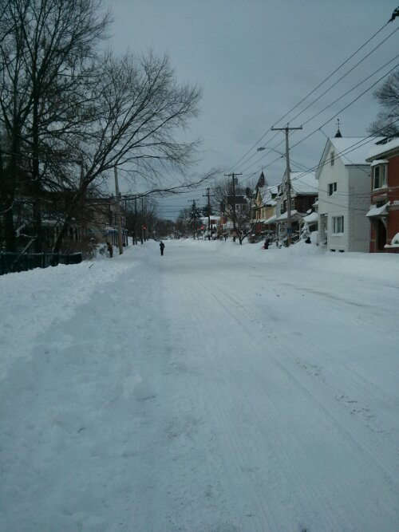

That awesome feeling of a 3 day weekend when its only Saturday and it feels like Sunday, aka the most miserable day of the week in my book, and you realized you still have one more day at home.

While most people hate the blizzard and the snow, I actually kinda love it. I'm a little sad now that all the snowing is over. I love waking up in the morning and see everything covered in snow. I guess I'm one of those rare people who genuinely love winter and the snow. And yes, I do a lot of shoveling too today, and more tomorrow, and I actually don't seem to mind it.

It is now officially Vietnamese new year, aka Tet! Although sometimes I wonder if it counts to wait till Eastern Time, since the lunar calendar is only used in Asia.

At any rate, Happy New Year to everyone! Have a safe, peaceful, prosperous and blessed year of the snake!

