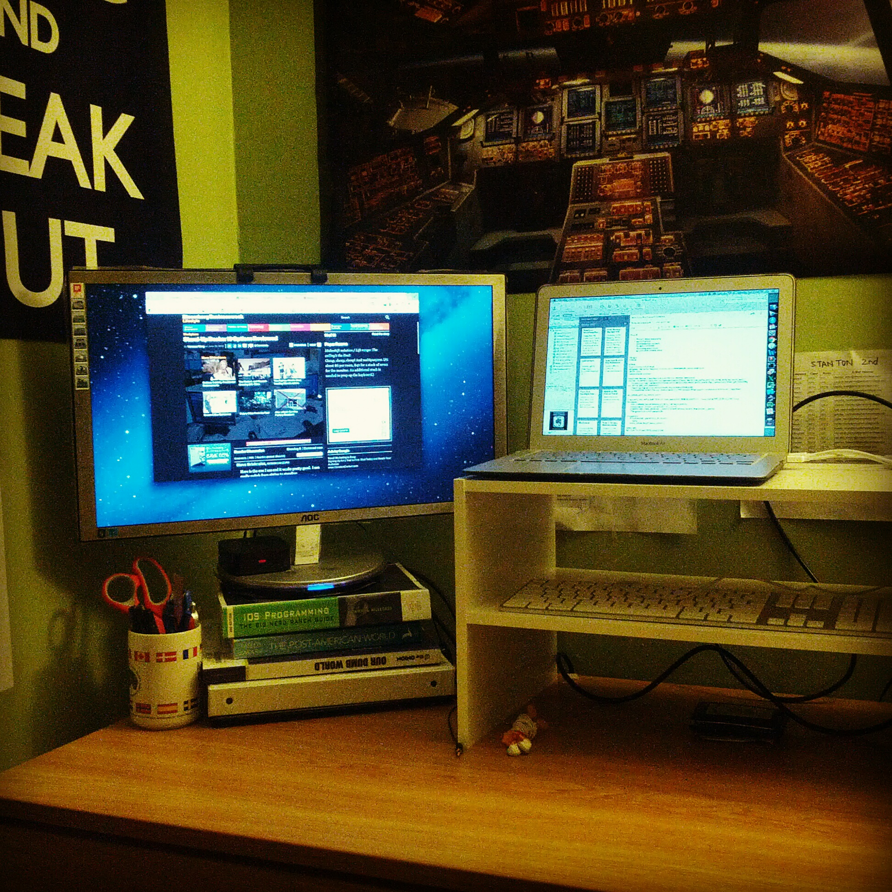
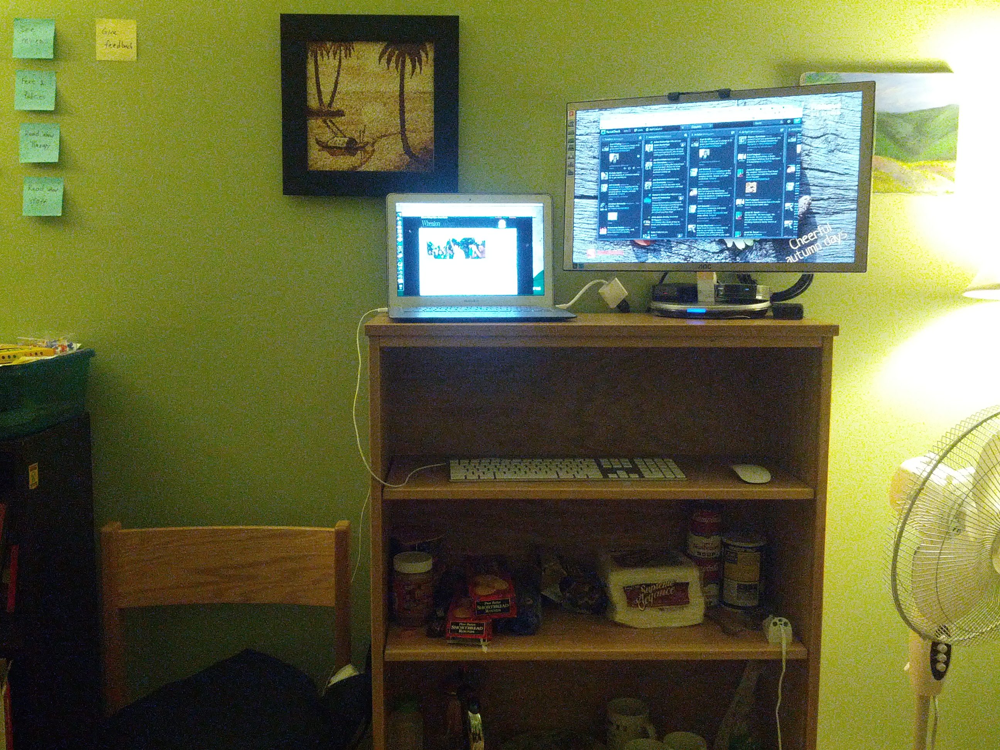

I've heard of the idea of a standing desk setup being tossed around lately (some people took pictures of their own setup on Twitter), but never really gave it much thought. Last night at the after party of [WordCamp Providence](http://2012.providence.wordcamp.org/), I had an interesting discussion with [Jon Desrosiers](http://jonathandesrosiers.com/) about a DIY standing desk setup that involves getting parts from IKEA.

Amused, on my way back from the conference, I stopped by Home Depot to see if they had any sort of frame I could use to create a make-shift experimental setup. I ended up getting a cheap shelf ($10) that was at a perfect height to stack on my desk.

A few nice things about this setup:

- The screens are at a good height - I need to tilt down a little while standing, but they're good to be viewed at when I'm sitting on a chair too (being new to this whole thing, I'm worried my legs will give up early)
-It actually clears up my table surface and gives me more space to work on non-computer-related, paper-based stuff, like writing

While this seemed to be a really nice setup, a few things about it bugged me.

- First, even though the keyboard is at the perfect height, it is too far from where I stand that I had to extend my reach considerably to type. This I imagined would be painful to my wrist after typing a long time.
- The stack of irregular books I used to elevate my second monitor just makes the whole thing look messy - destroy the purpose of the nice, minimalist white shelf.

After pondering for a while, I decided to do another experimental setup.

I utilize the top surface of my current shelf to house the monitors as it is at the perfect height for me. The keyboard and mouse are stored on the shelf right below it, which is also at the right height for my hand.

As I'm able to stand closer to this shelf than in the table setup above, my hands are a lot closer to the keyboard. Unfortunately, this also means that I'm looking at the big screen from a much closer distance.

While neither of these setups are perfect, the second ones gave me certain advantages:

- It separates my computer from the desk, thus allowing me to focus more on my paper-based tasks without the distraction of the Internet.
- It doesn't involve any clumsy stacking of books and at the same time free up precious surface space for my desk.
- This is tangential (but quite important), this shelf is right across from my bed, so I can watch movies using the big screen cozily and comfortable now.

So I've decided to stick with the second setup for now and see how it goes. I will update any benefits and drawbacks I might run into as I go along.

Another option, as I mentioned above, is to follow this guide on how to set up [a standing desk for $22](http://iamnotaprogrammer.com/Ikea-Standing-desk-for-22-dollars.html) (or even less if you buy cheaper parts). I'm very tempted to try it out but it costs a little bit more and the height of the side table is gonna be too high for 5'5" me.

There are many fancy standing desk setups out there that cost an upward of $500 to $5000, ones that allow you to adjust the height easily and look really nice and all that. But for a DIY, affordable setup ($10 for my first experiment, technically $0 for the second), I think that being creative will help achieve the same goal - to get you off your butt and be more healthy while working long hours in front of the computer.